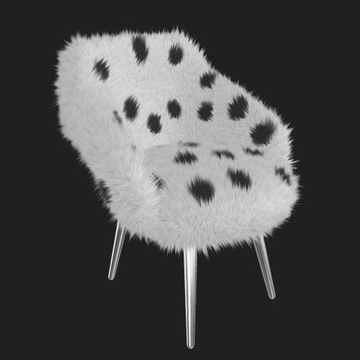
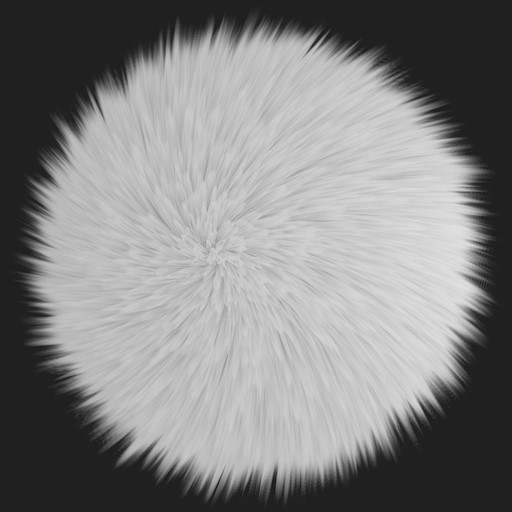

# fur-threejs

## Description
This project is my take on real-time fur rendering. The result is quite good and flexible since it can adapt to any 3D model. A few properties are customizable, such as length, thickness, orientation and color patterns.

Technically, I implemented the traditional shells and fins technique, adapted for WebGL (which lacks Geometry Shaders unfortunately).

See it live [here](https://piellardj.github.io/fur-threejs/).

## Preview

